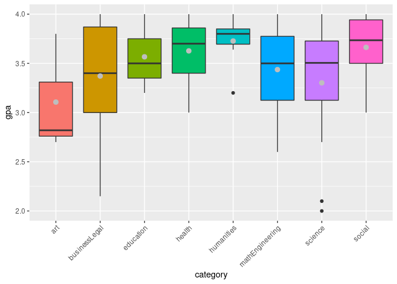
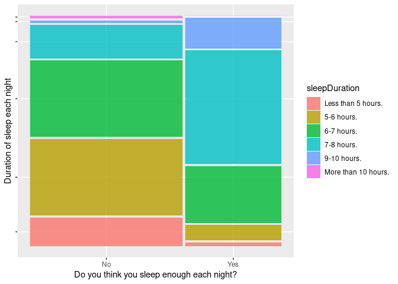

Final Reflection
================
Stella Sterling
12/2/2021

*loading packages and reading in files for possible examples…*

``` r
library(tidyverse)
library(knitr)
library(kableExtra)
library(ggmosaic)
```

``` r
rest_habits_raw <- readr::read_csv(here::here("data","418FinalProjData.csv"))
wine <- readr::read_csv(here::here("data","winemag-data-130k-v2.csv")) #ooo wine
```

    ## Warning: Missing column names filled in: 'X1' [1]

**1.** *Provide a URL for your final project. If you created a Shiny App
as your data product, you should include a link to the GitHub repository
that contains your code as well as a link to your Shiny App hosted on
shinyapp.io (see Chapter 2 of the shinyapps.io User Guide - this is
free, but you need to sign up for an account). If you created some other
type of data product, you should include a link to the GitHub repository
that contains your code as well as a direct link to your data product.*

<https://github.com/SSterling7/GVSURestHabitsProject>

<https://zcx0xl-stella-sterling.shinyapps.io/RestHabits/?_ga=2.27692981.820064628.1638498589-237385371.1636410798>
(this IS workinggggg)

------------------------------------------------------------------------

**2.** *Did you work with a group? If so, include the names of your
other group members here.*

Lauren Proctor

------------------------------------------------------------------------

**3.** *Write me a letter that reflects on your work in this class.Talk
about the work you’ve done for the course so far. Remember that I am
interested in the progress have you made towards each course-level
learning objectives. Look through your work to determine what you could
use to demonstrate your progress. (Provide links to or embed examples of
your work.) How does your work demonstrate your progress towards these
objectives? Consider the work you did on the final project, your work
earlier in the term, the feedback you offered your peers on their work,
and how you met your own goals. Feel free to include more links to
examples of your work as necessary (please point directly to the
specific work - not some general document link - so that I can easily
review it). Tell me what you are particularly proud of. This is the
place to be as honest as possible about your work, both reflecting
critically and talking about what you proved capable of in the midst of
an incredibly challenging semester. Remember that this is a reflection
about your work, not your classmates.*

Most of the objectives are fulfilled by the final project; particularly
objectives 1, 2, 4, and 5.

Areas I plan to cover outside of project in this reflection:

-   tidy data & transformations (pivots) (or just the transform func
    stuff)
-   joins
-   simulations
-   functions

###### Import, manage, and clean data

-   *I can import data from a variety of sources.*
-   *I can isolate information from a larger data source.*
-   *I can combine information from multiple data sources.*
-   *I can restructure information to be in a “tidy” format.*
-   *I can transform information to be in a format better suited for
    specific tasks.*

I’ve learned so much in this class! I feel comfortable reading in data
and manipulating it to some degree (it’s always the stupid mistakes that
get me, *cough cough*, back ticks \[had me going for a day\]).

Here is the “CLEAN DATA” section of the project. In these chunks I
removed unwanted rows/cols, renamed variables, and converted some
variable types; which helped improve the readability/manageability of
the data set.

-   removing things

``` r
rest_habits <- rest_habits_raw %>% 
  select(age:`mentalHealth _4`)
```

``` r
rest_habits <- rest_habits [-c(1,2),]

#this is removing blank observations (sex was one of the few variables that everyone responded to)
#went from 173 observations to 155.
rest_habits <- rest_habits %>% 
  filter(!is.na(sex))
```

-   renaming

``` r
rest_habits <- rest_habits %>% 
  rename(gpa=`gpa _1`,
         academics=`academic _1`,
         energy=`mentalHealth _1`,
         stress=`mentalHealth _2`,
         concentration=`mentalHealth _3`,
         mood=`mentalHealth _4`)
```

-   conversions (GPA and age make more sense when used as a numeric
    value)

``` r
rest_habits$gpa <- as.numeric(rest_habits$gpa)
```

    ## Warning: NAs introduced by coercion

``` r
rest_habits$age <- as.numeric(rest_habits$age)
```

-   here was an interesting part of the project for me. We had many
    different major types respond to the survey - we needed to group
    these some way! I disliked using GVSUs’ colleges as categories,
    mostly because CLAS would put things like Statistics, Japanese, or
    Sport Management into the same category. I think that the groupings
    I made make far more sense and allowed us to explore some
    differences between types of majors. I created a new variable called
    `category` to put the grouping in. As mentioned in our presentation,
    I still need to account for those who had more than 1 major. I think
    I could subset the majors using stringr; but I’d have to think more
    on how I’d count these observations. Would it be double counting one
    person if I put their information in each major category?

``` r
rest_habits$category <- rest_habits %>%
    add_column(category = NA)
```

``` r
rest_habits <- rest_habits %>%
   mutate(category = case_when(
     #Business & Legal
     grad %in% c("Communications", "Business Administration", "Criminal Justice") ~ "businessLegal",
     #Cultures and Humanities
     grad %in% c("") ~ "humanities",
     #Biological, Environmental, and Physical Sciences
     grad %in% c("Physics") ~ "science",
     #Education
     grad %in% c("Education", "Higher Education", "School Psychology") ~ "education",
     #Fine Arts and Design
     grad %in% ("") ~ "art",
     #Health and Medicine
     grad %in% c("Physician Assistant Studies", "Medical Dosimetry", "Public Health", "Physical Therapy", "Nursing") ~ "health",
     #Math and Engineering
     grad %in% c("Biostatistics", "Data Science and Analytics") ~ "mathEngineering",
     #Social and Behavioral Sciences
     grad %in% c("Speech-Language Pathology", "Social Work") ~ "social",
     #now for the rest of the degree types...
     undergrad %in% c("Multimedia Journalism", "Marketing", "Accounting", "Finance", "International Business", "Advertising and Public Relations", "Business,
                      General", "Management", "Hospitality and Tourism Management", "Human Resource Management", "Communication Studies",
                      "Criminal Justice", "Legal Studies", "Supply Chain Management") ~ "businessLegal",
     undergrad %in% c("French", "Spanish", "History", "English", "Writing", "Philosophy") ~ "humanities",
     undergrad %in% c("Biology", "Biochemistry", "Cell and Molecular Biology", "Wildlife Biology", "Natural Resources Management", 
                      "Environmental and Sustainability Studies", "Applied Food and Nutrition")  ~ "science",
     undergrad %in% c("Art Education") ~ "education",
     undergrad %in% c("Film and Video") ~ "art",
     undergrad %in% c("Physician Assistant Studies", "Medical Dosimetry", "Public Health", "Physical Therapy", "Nursing", 
                      "Preprofessional Studies", "Exercise Science", "Allied Health Sciences", "Biomedical Sciences", "Radiation Therapy", 
                      "Recreational Therapy", "Health Information Management") ~ "health",
     undergrad %in% c("Electrical Engineering", "Biostatistics", "Statistics", "Mathematics", "Biomedical Engineering", "Computer Science", 
                      "Cybersecurity") ~ "mathEngineering",
     undergrad %in% c("Speech-Language Pathology", "Social Work", "Psychology") ~ "social",
     
     combined %in% c("Accounting") ~ "businessLegal",
     combined %in% c("Cell and Molecular Biology") ~ "science",
     combined %in% c("Exercise Science and Athletic Training") ~ "health",
     combined %in% c("Statistics", "Biostatistics", "Cybersecurity", "Statistics and Biostatistics") ~ "mathEngineering"
     )
   )
```

-   So out with the old, in with the new? The cleaned dataset was easier
    to understand and work with.

``` r
rest_habits_raw %>% # old
  slice(1:10) %>% 
  kable()
```

<table>
<thead>
<tr>
<th style="text-align:left;">
StartDate
</th>
<th style="text-align:left;">
EndDate
</th>
<th style="text-align:left;">
Status
</th>
<th style="text-align:left;">
Progress
</th>
<th style="text-align:left;">
Duration (in seconds)
</th>
<th style="text-align:left;">
Finished
</th>
<th style="text-align:left;">
RecordedDate
</th>
<th style="text-align:left;">
ResponseId
</th>
<th style="text-align:left;">
DistributionChannel
</th>
<th style="text-align:left;">
UserLanguage
</th>
<th style="text-align:left;">
age
</th>
<th style="text-align:left;">
sex
</th>
<th style="text-align:left;">
race
</th>
<th style="text-align:left;">
year
</th>
<th style="text-align:left;">
gpa \_1
</th>
<th style="text-align:left;">
degree
</th>
<th style="text-align:left;">
undergrad
</th>
<th style="text-align:left;">
grad
</th>
<th style="text-align:left;">
combined
</th>
<th style="text-align:left;">
sleepDuration
</th>
<th style="text-align:left;">
sleepEnough
</th>
<th style="text-align:left;">
regSleep
</th>
<th style="text-align:left;">
sleepCatchUp
</th>
<th style="text-align:left;">
allNighter
</th>
<th style="text-align:left;">
dayTired
</th>
<th style="text-align:left;">
fallStayAsleep
</th>
<th style="text-align:left;">
sleepDisorder
</th>
<th style="text-align:left;">
napFreq
</th>
<th style="text-align:left;">
napDuration
</th>
<th style="text-align:left;">
leisureTime
</th>
<th style="text-align:left;">
leisureFreq
</th>
<th style="text-align:left;">
socialMedia
</th>
<th style="text-align:left;">
socMedDuration
</th>
<th style="text-align:left;">
academic \_1
</th>
<th style="text-align:left;">
mentalHealth \_1
</th>
<th style="text-align:left;">
mentalHealth \_2
</th>
<th style="text-align:left;">
mentalHealth \_3
</th>
<th style="text-align:left;">
mentalHealth \_4
</th>
</tr>
</thead>
<tbody>
<tr>
<td style="text-align:left;">
Start Date
</td>
<td style="text-align:left;">
End Date
</td>
<td style="text-align:left;">
Response Type
</td>
<td style="text-align:left;">
Progress
</td>
<td style="text-align:left;">
Duration (in seconds)
</td>
<td style="text-align:left;">
Finished
</td>
<td style="text-align:left;">
Recorded Date
</td>
<td style="text-align:left;">
Response ID
</td>
<td style="text-align:left;">
Distribution Channel
</td>
<td style="text-align:left;">
User Language
</td>
<td style="text-align:left;">
What is your age?
</td>
<td style="text-align:left;">
What is your sex (assigned at birth)?
</td>
<td style="text-align:left;">
What is your race/ethnicity?
</td>
<td style="text-align:left;">
What school year are you in?
</td>
<td style="text-align:left;">
What is your GPA? - Please enter in 0.00 format.
</td>
<td style="text-align:left;">
What type of degree are you pursuing?
</td>
<td style="text-align:left;">
What is your major? (undergraduate)
</td>
<td style="text-align:left;">
What is your major? (graduate)
</td>
<td style="text-align:left;">
What is your combined degree in?
</td>
<td style="text-align:left;">
During a regular semester, how many hours do you sleep each night on
average?
</td>
<td style="text-align:left;">
Do you feel like the amount you sleep each night is enough for you?
</td>
<td style="text-align:left;">
Do you have a regular sleep schedule (do you wake up and go to bed
around the same time everyday)?
</td>
<td style="text-align:left;">
Do you try to “catch-up” on sleep by sleeping-in when you can?
</td>
<td style="text-align:left;">
During a regular semester, do you ever “pull an all-nighter” to study?
</td>
<td style="text-align:left;">
After a full nights rest, do you often still feel tired during the day?
</td>
<td style="text-align:left;">
Do you have trouble falling or staying asleep?
</td>
<td style="text-align:left;">
Have you been diagnosed with a sleeping disorder?
</td>
<td style="text-align:left;">
How often do you nap during a regular semester?
</td>
<td style="text-align:left;">
How long do you usually nap for?
</td>
<td style="text-align:left;">
Do you have leisure time? In other words, do you spend time on
activities not related to school or work (reading, drawing, watching TV,
etc.)?
</td>
<td style="text-align:left;">
During a regular semester, how much leisure time do you have?
</td>
<td style="text-align:left;">
Do you use social media?
</td>
<td style="text-align:left;">
How much time do you spend on social media?
</td>
<td style="text-align:left;">
How do you feel you are doing academically? - Select One
</td>
<td style="text-align:left;">
In general, how would you describe your mental health? - Motivation &
Energy
</td>
<td style="text-align:left;">
In general, how would you describe your mental health? - Stress Levels
</td>
<td style="text-align:left;">
In general, how would you describe your mental health? - Concentration
</td>
<td style="text-align:left;">
In general, how would you describe your mental health? - Overall Mood
</td>
</tr>
<tr>
<td style="text-align:left;">
{“ImportId”:“startDate”,“timeZone”:“America/Denver”}
</td>
<td style="text-align:left;">
{“ImportId”:“endDate”,“timeZone”:“America/Denver”}
</td>
<td style="text-align:left;">
{“ImportId”:“status”}
</td>
<td style="text-align:left;">
{“ImportId”:“progress”}
</td>
<td style="text-align:left;">
{“ImportId”:“duration”}
</td>
<td style="text-align:left;">
{“ImportId”:“finished”}
</td>
<td style="text-align:left;">
{“ImportId”:“recordedDate”,“timeZone”:“America/Denver”}
</td>
<td style="text-align:left;">
{“ImportId”:"\_recordId"}
</td>
<td style="text-align:left;">
{“ImportId”:“distributionChannel”}
</td>
<td style="text-align:left;">
{“ImportId”:“userLanguage”}
</td>
<td style="text-align:left;">
{“ImportId”:“QID1”}
</td>
<td style="text-align:left;">
{“ImportId”:“QID17”}
</td>
<td style="text-align:left;">
{“ImportId”:“QID2”}
</td>
<td style="text-align:left;">
{“ImportId”:“QID3”}
</td>
<td style="text-align:left;">
{“ImportId”:“QID6\_1”}
</td>
<td style="text-align:left;">
{“ImportId”:“QID24”}
</td>
<td style="text-align:left;">
{“ImportId”:“QID9”}
</td>
<td style="text-align:left;">
{“ImportId”:“QID25”}
</td>
<td style="text-align:left;">
{“ImportId”:“QID26”}
</td>
<td style="text-align:left;">
{“ImportId”:“QID18”}
</td>
<td style="text-align:left;">
{“ImportId”:“QID19”}
</td>
<td style="text-align:left;">
{“ImportId”:“QID20”}
</td>
<td style="text-align:left;">
{“ImportId”:“QID21”}
</td>
<td style="text-align:left;">
{“ImportId”:“QID5”}
</td>
<td style="text-align:left;">
{“ImportId”:“QID15”}
</td>
<td style="text-align:left;">
{“ImportId”:“QID11”}
</td>
<td style="text-align:left;">
{“ImportId”:“QID12”}
</td>
<td style="text-align:left;">
{“ImportId”:“QID22”}
</td>
<td style="text-align:left;">
{“ImportId”:“QID23”}
</td>
<td style="text-align:left;">
{“ImportId”:“QID7”}
</td>
<td style="text-align:left;">
{“ImportId”:“QID28”}
</td>
<td style="text-align:left;">
{“ImportId”:“QID31”}
</td>
<td style="text-align:left;">
{“ImportId”:“QID8”}
</td>
<td style="text-align:left;">
{“ImportId”:“QID14\_1”}
</td>
<td style="text-align:left;">
{“ImportId”:“QID16\_1”}
</td>
<td style="text-align:left;">
{“ImportId”:“QID16\_2”}
</td>
<td style="text-align:left;">
{“ImportId”:“QID16\_3”}
</td>
<td style="text-align:left;">
{“ImportId”:“QID16\_4”}
</td>
</tr>
<tr>
<td style="text-align:left;">
2021-11-18 14:01:38
</td>
<td style="text-align:left;">
2021-11-18 14:04:05
</td>
<td style="text-align:left;">
IP Address
</td>
<td style="text-align:left;">
100
</td>
<td style="text-align:left;">
147
</td>
<td style="text-align:left;">
TRUE
</td>
<td style="text-align:left;">
2021-11-18 14:04:05
</td>
<td style="text-align:left;">
R\_WedrFrciXIoIuiZ
</td>
<td style="text-align:left;">
anonymous
</td>
<td style="text-align:left;">
EN
</td>
<td style="text-align:left;">
20
</td>
<td style="text-align:left;">
Male
</td>
<td style="text-align:left;">
White or Caucasian
</td>
<td style="text-align:left;">
Third year
</td>
<td style="text-align:left;">
3.98
</td>
<td style="text-align:left;">
Undergraduate
</td>
<td style="text-align:left;">
Marketing
</td>
<td style="text-align:left;">
NA
</td>
<td style="text-align:left;">
NA
</td>
<td style="text-align:left;">
5-6 hours.
</td>
<td style="text-align:left;">
No
</td>
<td style="text-align:left;">
No
</td>
<td style="text-align:left;">
Yes
</td>
<td style="text-align:left;">
No, never.
</td>
<td style="text-align:left;">
Yes
</td>
<td style="text-align:left;">
No
</td>
<td style="text-align:left;">
NA
</td>
<td style="text-align:left;">
Rarely
</td>
<td style="text-align:left;">
30-60 minutes.
</td>
<td style="text-align:left;">
No
</td>
<td style="text-align:left;">
NA
</td>
<td style="text-align:left;">
Yes
</td>
<td style="text-align:left;">
1-3 hours/day.
</td>
<td style="text-align:left;">
Good
</td>
<td style="text-align:left;">
Ok
</td>
<td style="text-align:left;">
Not Good
</td>
<td style="text-align:left;">
Ok
</td>
<td style="text-align:left;">
Not Good
</td>
</tr>
<tr>
<td style="text-align:left;">
2021-11-18 14:12:24
</td>
<td style="text-align:left;">
2021-11-18 14:14:10
</td>
<td style="text-align:left;">
IP Address
</td>
<td style="text-align:left;">
100
</td>
<td style="text-align:left;">
106
</td>
<td style="text-align:left;">
TRUE
</td>
<td style="text-align:left;">
2021-11-18 14:14:10
</td>
<td style="text-align:left;">
R\_3lXHHPKHx0VH4ws
</td>
<td style="text-align:left;">
anonymous
</td>
<td style="text-align:left;">
EN
</td>
<td style="text-align:left;">
21
</td>
<td style="text-align:left;">
Female
</td>
<td style="text-align:left;">
White or Caucasian
</td>
<td style="text-align:left;">
Fourth year
</td>
<td style="text-align:left;">
2.1
</td>
<td style="text-align:left;">
Undergraduate
</td>
<td style="text-align:left;">
Biology
</td>
<td style="text-align:left;">
NA
</td>
<td style="text-align:left;">
NA
</td>
<td style="text-align:left;">
Less than 5 hours.
</td>
<td style="text-align:left;">
No
</td>
<td style="text-align:left;">
No
</td>
<td style="text-align:left;">
No
</td>
<td style="text-align:left;">
Yes, I do it often.
</td>
<td style="text-align:left;">
Yes
</td>
<td style="text-align:left;">
Yes
</td>
<td style="text-align:left;">
Yes
</td>
<td style="text-align:left;">
Rarely
</td>
<td style="text-align:left;">
Less than 30 minutes.
</td>
<td style="text-align:left;">
No
</td>
<td style="text-align:left;">
NA
</td>
<td style="text-align:left;">
Yes
</td>
<td style="text-align:left;">
1-3 hours/day.
</td>
<td style="text-align:left;">
Ok
</td>
<td style="text-align:left;">
Not Good
</td>
<td style="text-align:left;">
Bad
</td>
<td style="text-align:left;">
Not Good
</td>
<td style="text-align:left;">
Bad
</td>
</tr>
<tr>
<td style="text-align:left;">
2021-11-18 14:27:56
</td>
<td style="text-align:left;">
2021-11-18 14:31:02
</td>
<td style="text-align:left;">
IP Address
</td>
<td style="text-align:left;">
100
</td>
<td style="text-align:left;">
186
</td>
<td style="text-align:left;">
TRUE
</td>
<td style="text-align:left;">
2021-11-18 14:31:02
</td>
<td style="text-align:left;">
R\_27D7l6uPtrHFfmp
</td>
<td style="text-align:left;">
qr
</td>
<td style="text-align:left;">
EN
</td>
<td style="text-align:left;">
24
</td>
<td style="text-align:left;">
Female
</td>
<td style="text-align:left;">
White or Caucasian
</td>
<td style="text-align:left;">
Fifth or more year
</td>
<td style="text-align:left;">
3.50
</td>
<td style="text-align:left;">
Graduate
</td>
<td style="text-align:left;">
NA
</td>
<td style="text-align:left;">
Biostatistics
</td>
<td style="text-align:left;">
NA
</td>
<td style="text-align:left;">
7-8 hours.
</td>
<td style="text-align:left;">
No
</td>
<td style="text-align:left;">
No
</td>
<td style="text-align:left;">
Yes
</td>
<td style="text-align:left;">
Yes, rarely.
</td>
<td style="text-align:left;">
Yes
</td>
<td style="text-align:left;">
Yes
</td>
<td style="text-align:left;">
No
</td>
<td style="text-align:left;">
Never
</td>
<td style="text-align:left;">
NA
</td>
<td style="text-align:left;">
No
</td>
<td style="text-align:left;">
NA
</td>
<td style="text-align:left;">
Yes
</td>
<td style="text-align:left;">
1-3 hours/day.
</td>
<td style="text-align:left;">
Ok
</td>
<td style="text-align:left;">
Ok
</td>
<td style="text-align:left;">
Good
</td>
<td style="text-align:left;">
Not Good
</td>
<td style="text-align:left;">
Good
</td>
</tr>
<tr>
<td style="text-align:left;">
2021-11-18 14:27:31
</td>
<td style="text-align:left;">
2021-11-18 14:31:08
</td>
<td style="text-align:left;">
IP Address
</td>
<td style="text-align:left;">
100
</td>
<td style="text-align:left;">
216
</td>
<td style="text-align:left;">
TRUE
</td>
<td style="text-align:left;">
2021-11-18 14:31:08
</td>
<td style="text-align:left;">
R\_1kM2q29rTjJaH2q
</td>
<td style="text-align:left;">
qr
</td>
<td style="text-align:left;">
EN
</td>
<td style="text-align:left;">
20
</td>
<td style="text-align:left;">
Male
</td>
<td style="text-align:left;">
White or Caucasian
</td>
<td style="text-align:left;">
Second year
</td>
<td style="text-align:left;">
3.913
</td>
<td style="text-align:left;">
Undergraduate
</td>
<td style="text-align:left;">
Psychology,Statistics
</td>
<td style="text-align:left;">
NA
</td>
<td style="text-align:left;">
NA
</td>
<td style="text-align:left;">
7-8 hours.
</td>
<td style="text-align:left;">
No
</td>
<td style="text-align:left;">
Yes
</td>
<td style="text-align:left;">
Yes
</td>
<td style="text-align:left;">
No, never.
</td>
<td style="text-align:left;">
Yes
</td>
<td style="text-align:left;">
Yes
</td>
<td style="text-align:left;">
No
</td>
<td style="text-align:left;">
Never
</td>
<td style="text-align:left;">
NA
</td>
<td style="text-align:left;">
No
</td>
<td style="text-align:left;">
NA
</td>
<td style="text-align:left;">
Yes
</td>
<td style="text-align:left;">
1-3 hours/day.
</td>
<td style="text-align:left;">
Great
</td>
<td style="text-align:left;">
Not Good
</td>
<td style="text-align:left;">
Bad
</td>
<td style="text-align:left;">
Good
</td>
<td style="text-align:left;">
Ok
</td>
</tr>
<tr>
<td style="text-align:left;">
2021-11-18 14:27:42
</td>
<td style="text-align:left;">
2021-11-18 14:36:26
</td>
<td style="text-align:left;">
IP Address
</td>
<td style="text-align:left;">
100
</td>
<td style="text-align:left;">
523
</td>
<td style="text-align:left;">
TRUE
</td>
<td style="text-align:left;">
2021-11-18 14:36:26
</td>
<td style="text-align:left;">
R\_1EaOrOJ1ewYBPob
</td>
<td style="text-align:left;">
qr
</td>
<td style="text-align:left;">
EN
</td>
<td style="text-align:left;">
21
</td>
<td style="text-align:left;">
Female
</td>
<td style="text-align:left;">
White or Caucasian
</td>
<td style="text-align:left;">
Third year
</td>
<td style="text-align:left;">
3.78
</td>
<td style="text-align:left;">
Combined Degree
</td>
<td style="text-align:left;">
NA
</td>
<td style="text-align:left;">
NA
</td>
<td style="text-align:left;">
Statistics and Biostatistics
</td>
<td style="text-align:left;">
7-8 hours.
</td>
<td style="text-align:left;">
Yes
</td>
<td style="text-align:left;">
Yes
</td>
<td style="text-align:left;">
Yes
</td>
<td style="text-align:left;">
Yes, rarely.
</td>
<td style="text-align:left;">
No
</td>
<td style="text-align:left;">
Yes
</td>
<td style="text-align:left;">
No
</td>
<td style="text-align:left;">
Every day
</td>
<td style="text-align:left;">
30-60 minutes.
</td>
<td style="text-align:left;">
Yes
</td>
<td style="text-align:left;">
1-3 hours/day.
</td>
<td style="text-align:left;">
Yes
</td>
<td style="text-align:left;">
1-3 hours/day.
</td>
<td style="text-align:left;">
Great
</td>
<td style="text-align:left;">
Good
</td>
<td style="text-align:left;">
Great
</td>
<td style="text-align:left;">
Good
</td>
<td style="text-align:left;">
Great
</td>
</tr>
<tr>
<td style="text-align:left;">
2021-11-18 14:34:33
</td>
<td style="text-align:left;">
2021-11-18 14:41:19
</td>
<td style="text-align:left;">
IP Address
</td>
<td style="text-align:left;">
100
</td>
<td style="text-align:left;">
405
</td>
<td style="text-align:left;">
TRUE
</td>
<td style="text-align:left;">
2021-11-18 14:41:19
</td>
<td style="text-align:left;">
R\_1hWinJzP6dbyruj
</td>
<td style="text-align:left;">
anonymous
</td>
<td style="text-align:left;">
EN
</td>
<td style="text-align:left;">
NA
</td>
<td style="text-align:left;">
Male
</td>
<td style="text-align:left;">
Multiracial or Biracial
</td>
<td style="text-align:left;">
Second year
</td>
<td style="text-align:left;">
4.0
</td>
<td style="text-align:left;">
Undergraduate
</td>
<td style="text-align:left;">
Writing
</td>
<td style="text-align:left;">
NA
</td>
<td style="text-align:left;">
NA
</td>
<td style="text-align:left;">
6-7 hours.
</td>
<td style="text-align:left;">
Yes
</td>
<td style="text-align:left;">
Yes
</td>
<td style="text-align:left;">
Yes
</td>
<td style="text-align:left;">
Yes, rarely.
</td>
<td style="text-align:left;">
No
</td>
<td style="text-align:left;">
No
</td>
<td style="text-align:left;">
NA
</td>
<td style="text-align:left;">
Rarely
</td>
<td style="text-align:left;">
More than 90 minutes.
</td>
<td style="text-align:left;">
Yes
</td>
<td style="text-align:left;">
I spend some time on personal activities a few times a week.
</td>
<td style="text-align:left;">
Yes
</td>
<td style="text-align:left;">
Less than 1 hour/day.
</td>
<td style="text-align:left;">
Ok
</td>
<td style="text-align:left;">
Not Good
</td>
<td style="text-align:left;">
Bad
</td>
<td style="text-align:left;">
Not Good
</td>
<td style="text-align:left;">
Ok
</td>
</tr>
<tr>
<td style="text-align:left;">
2021-11-18 14:41:31
</td>
<td style="text-align:left;">
2021-11-18 14:43:03
</td>
<td style="text-align:left;">
IP Address
</td>
<td style="text-align:left;">
100
</td>
<td style="text-align:left;">
92
</td>
<td style="text-align:left;">
TRUE
</td>
<td style="text-align:left;">
2021-11-18 14:43:04
</td>
<td style="text-align:left;">
R\_3R49mA3v8KGB66g
</td>
<td style="text-align:left;">
anonymous
</td>
<td style="text-align:left;">
EN
</td>
<td style="text-align:left;">
NA
</td>
<td style="text-align:left;">
Male
</td>
<td style="text-align:left;">
White or Caucasian
</td>
<td style="text-align:left;">
Fourth year
</td>
<td style="text-align:left;">
2.7
</td>
<td style="text-align:left;">
Undergraduate
</td>
<td style="text-align:left;">
Film and Video
</td>
<td style="text-align:left;">
NA
</td>
<td style="text-align:left;">
NA
</td>
<td style="text-align:left;">
9-10 hours.
</td>
<td style="text-align:left;">
No
</td>
<td style="text-align:left;">
No
</td>
<td style="text-align:left;">
No
</td>
<td style="text-align:left;">
Yes, rarely.
</td>
<td style="text-align:left;">
Yes
</td>
<td style="text-align:left;">
Yes
</td>
<td style="text-align:left;">
Yes
</td>
<td style="text-align:left;">
Rarely
</td>
<td style="text-align:left;">
60-90 minutes.
</td>
<td style="text-align:left;">
Yes
</td>
<td style="text-align:left;">
1-3 hours/day.
</td>
<td style="text-align:left;">
No
</td>
<td style="text-align:left;">
NA
</td>
<td style="text-align:left;">
Good
</td>
<td style="text-align:left;">
Bad
</td>
<td style="text-align:left;">
Ok
</td>
<td style="text-align:left;">
Bad
</td>
<td style="text-align:left;">
Ok
</td>
</tr>
<tr>
<td style="text-align:left;">
2021-11-18 15:06:35
</td>
<td style="text-align:left;">
2021-11-18 15:12:15
</td>
<td style="text-align:left;">
IP Address
</td>
<td style="text-align:left;">
100
</td>
<td style="text-align:left;">
339
</td>
<td style="text-align:left;">
TRUE
</td>
<td style="text-align:left;">
2021-11-18 15:12:15
</td>
<td style="text-align:left;">
R\_2s7oYkPYSlv6Pmc
</td>
<td style="text-align:left;">
anonymous
</td>
<td style="text-align:left;">
EN
</td>
<td style="text-align:left;">
20
</td>
<td style="text-align:left;">
Male
</td>
<td style="text-align:left;">
White or Caucasian
</td>
<td style="text-align:left;">
Third year
</td>
<td style="text-align:left;">
3.90
</td>
<td style="text-align:left;">
Undergraduate
</td>
<td style="text-align:left;">
Cybersecurity
</td>
<td style="text-align:left;">
NA
</td>
<td style="text-align:left;">
NA
</td>
<td style="text-align:left;">
6-7 hours.
</td>
<td style="text-align:left;">
No
</td>
<td style="text-align:left;">
No
</td>
<td style="text-align:left;">
Yes
</td>
<td style="text-align:left;">
No, never.
</td>
<td style="text-align:left;">
Yes
</td>
<td style="text-align:left;">
Yes
</td>
<td style="text-align:left;">
No
</td>
<td style="text-align:left;">
Rarely
</td>
<td style="text-align:left;">
Less than 30 minutes.
</td>
<td style="text-align:left;">
Yes
</td>
<td style="text-align:left;">
1-3 hours/day.
</td>
<td style="text-align:left;">
No
</td>
<td style="text-align:left;">
NA
</td>
<td style="text-align:left;">
Great
</td>
<td style="text-align:left;">
Not Good
</td>
<td style="text-align:left;">
Good
</td>
<td style="text-align:left;">
Ok
</td>
<td style="text-align:left;">
Ok
</td>
</tr>
</tbody>
</table>

``` r
rest_habits %>% # cleaned
  slice(1:10) %>%
  kable() # not to call anyone out but the second observation in this table is everything I don't want to see when analyzing rest habits
```

<table>
<thead>
<tr>
<th style="text-align:right;">
age
</th>
<th style="text-align:left;">
sex
</th>
<th style="text-align:left;">
race
</th>
<th style="text-align:left;">
year
</th>
<th style="text-align:right;">
gpa
</th>
<th style="text-align:left;">
degree
</th>
<th style="text-align:left;">
undergrad
</th>
<th style="text-align:left;">
grad
</th>
<th style="text-align:left;">
combined
</th>
<th style="text-align:left;">
sleepDuration
</th>
<th style="text-align:left;">
sleepEnough
</th>
<th style="text-align:left;">
regSleep
</th>
<th style="text-align:left;">
sleepCatchUp
</th>
<th style="text-align:left;">
allNighter
</th>
<th style="text-align:left;">
dayTired
</th>
<th style="text-align:left;">
fallStayAsleep
</th>
<th style="text-align:left;">
sleepDisorder
</th>
<th style="text-align:left;">
napFreq
</th>
<th style="text-align:left;">
napDuration
</th>
<th style="text-align:left;">
leisureTime
</th>
<th style="text-align:left;">
leisureFreq
</th>
<th style="text-align:left;">
socialMedia
</th>
<th style="text-align:left;">
socMedDuration
</th>
<th style="text-align:left;">
academics
</th>
<th style="text-align:left;">
energy
</th>
<th style="text-align:left;">
stress
</th>
<th style="text-align:left;">
concentration
</th>
<th style="text-align:left;">
mood
</th>
<th style="text-align:left;">
category
</th>
</tr>
</thead>
<tbody>
<tr>
<td style="text-align:right;">
20
</td>
<td style="text-align:left;">
Male
</td>
<td style="text-align:left;">
White or Caucasian
</td>
<td style="text-align:left;">
Third year
</td>
<td style="text-align:right;">
3.980
</td>
<td style="text-align:left;">
Undergraduate
</td>
<td style="text-align:left;">
Marketing
</td>
<td style="text-align:left;">
NA
</td>
<td style="text-align:left;">
NA
</td>
<td style="text-align:left;">
5-6 hours.
</td>
<td style="text-align:left;">
No
</td>
<td style="text-align:left;">
No
</td>
<td style="text-align:left;">
Yes
</td>
<td style="text-align:left;">
No, never.
</td>
<td style="text-align:left;">
Yes
</td>
<td style="text-align:left;">
No
</td>
<td style="text-align:left;">
NA
</td>
<td style="text-align:left;">
Rarely
</td>
<td style="text-align:left;">
30-60 minutes.
</td>
<td style="text-align:left;">
No
</td>
<td style="text-align:left;">
NA
</td>
<td style="text-align:left;">
Yes
</td>
<td style="text-align:left;">
1-3 hours/day.
</td>
<td style="text-align:left;">
Good
</td>
<td style="text-align:left;">
Ok
</td>
<td style="text-align:left;">
Not Good
</td>
<td style="text-align:left;">
Ok
</td>
<td style="text-align:left;">
Not Good
</td>
<td style="text-align:left;">
businessLegal
</td>
</tr>
<tr>
<td style="text-align:right;">
21
</td>
<td style="text-align:left;">
Female
</td>
<td style="text-align:left;">
White or Caucasian
</td>
<td style="text-align:left;">
Fourth year
</td>
<td style="text-align:right;">
2.100
</td>
<td style="text-align:left;">
Undergraduate
</td>
<td style="text-align:left;">
Biology
</td>
<td style="text-align:left;">
NA
</td>
<td style="text-align:left;">
NA
</td>
<td style="text-align:left;">
Less than 5 hours.
</td>
<td style="text-align:left;">
No
</td>
<td style="text-align:left;">
No
</td>
<td style="text-align:left;">
No
</td>
<td style="text-align:left;">
Yes, I do it often.
</td>
<td style="text-align:left;">
Yes
</td>
<td style="text-align:left;">
Yes
</td>
<td style="text-align:left;">
Yes
</td>
<td style="text-align:left;">
Rarely
</td>
<td style="text-align:left;">
Less than 30 minutes.
</td>
<td style="text-align:left;">
No
</td>
<td style="text-align:left;">
NA
</td>
<td style="text-align:left;">
Yes
</td>
<td style="text-align:left;">
1-3 hours/day.
</td>
<td style="text-align:left;">
Ok
</td>
<td style="text-align:left;">
Not Good
</td>
<td style="text-align:left;">
Bad
</td>
<td style="text-align:left;">
Not Good
</td>
<td style="text-align:left;">
Bad
</td>
<td style="text-align:left;">
science
</td>
</tr>
<tr>
<td style="text-align:right;">
24
</td>
<td style="text-align:left;">
Female
</td>
<td style="text-align:left;">
White or Caucasian
</td>
<td style="text-align:left;">
Fifth or more year
</td>
<td style="text-align:right;">
3.500
</td>
<td style="text-align:left;">
Graduate
</td>
<td style="text-align:left;">
NA
</td>
<td style="text-align:left;">
Biostatistics
</td>
<td style="text-align:left;">
NA
</td>
<td style="text-align:left;">
7-8 hours.
</td>
<td style="text-align:left;">
No
</td>
<td style="text-align:left;">
No
</td>
<td style="text-align:left;">
Yes
</td>
<td style="text-align:left;">
Yes, rarely.
</td>
<td style="text-align:left;">
Yes
</td>
<td style="text-align:left;">
Yes
</td>
<td style="text-align:left;">
No
</td>
<td style="text-align:left;">
Never
</td>
<td style="text-align:left;">
NA
</td>
<td style="text-align:left;">
No
</td>
<td style="text-align:left;">
NA
</td>
<td style="text-align:left;">
Yes
</td>
<td style="text-align:left;">
1-3 hours/day.
</td>
<td style="text-align:left;">
Ok
</td>
<td style="text-align:left;">
Ok
</td>
<td style="text-align:left;">
Good
</td>
<td style="text-align:left;">
Not Good
</td>
<td style="text-align:left;">
Good
</td>
<td style="text-align:left;">
mathEngineering
</td>
</tr>
<tr>
<td style="text-align:right;">
20
</td>
<td style="text-align:left;">
Male
</td>
<td style="text-align:left;">
White or Caucasian
</td>
<td style="text-align:left;">
Second year
</td>
<td style="text-align:right;">
3.913
</td>
<td style="text-align:left;">
Undergraduate
</td>
<td style="text-align:left;">
Psychology,Statistics
</td>
<td style="text-align:left;">
NA
</td>
<td style="text-align:left;">
NA
</td>
<td style="text-align:left;">
7-8 hours.
</td>
<td style="text-align:left;">
No
</td>
<td style="text-align:left;">
Yes
</td>
<td style="text-align:left;">
Yes
</td>
<td style="text-align:left;">
No, never.
</td>
<td style="text-align:left;">
Yes
</td>
<td style="text-align:left;">
Yes
</td>
<td style="text-align:left;">
No
</td>
<td style="text-align:left;">
Never
</td>
<td style="text-align:left;">
NA
</td>
<td style="text-align:left;">
No
</td>
<td style="text-align:left;">
NA
</td>
<td style="text-align:left;">
Yes
</td>
<td style="text-align:left;">
1-3 hours/day.
</td>
<td style="text-align:left;">
Great
</td>
<td style="text-align:left;">
Not Good
</td>
<td style="text-align:left;">
Bad
</td>
<td style="text-align:left;">
Good
</td>
<td style="text-align:left;">
Ok
</td>
<td style="text-align:left;">
NA
</td>
</tr>
<tr>
<td style="text-align:right;">
21
</td>
<td style="text-align:left;">
Female
</td>
<td style="text-align:left;">
White or Caucasian
</td>
<td style="text-align:left;">
Third year
</td>
<td style="text-align:right;">
3.780
</td>
<td style="text-align:left;">
Combined Degree
</td>
<td style="text-align:left;">
NA
</td>
<td style="text-align:left;">
NA
</td>
<td style="text-align:left;">
Statistics and Biostatistics
</td>
<td style="text-align:left;">
7-8 hours.
</td>
<td style="text-align:left;">
Yes
</td>
<td style="text-align:left;">
Yes
</td>
<td style="text-align:left;">
Yes
</td>
<td style="text-align:left;">
Yes, rarely.
</td>
<td style="text-align:left;">
No
</td>
<td style="text-align:left;">
Yes
</td>
<td style="text-align:left;">
No
</td>
<td style="text-align:left;">
Every day
</td>
<td style="text-align:left;">
30-60 minutes.
</td>
<td style="text-align:left;">
Yes
</td>
<td style="text-align:left;">
1-3 hours/day.
</td>
<td style="text-align:left;">
Yes
</td>
<td style="text-align:left;">
1-3 hours/day.
</td>
<td style="text-align:left;">
Great
</td>
<td style="text-align:left;">
Good
</td>
<td style="text-align:left;">
Great
</td>
<td style="text-align:left;">
Good
</td>
<td style="text-align:left;">
Great
</td>
<td style="text-align:left;">
mathEngineering
</td>
</tr>
<tr>
<td style="text-align:right;">
NA
</td>
<td style="text-align:left;">
Male
</td>
<td style="text-align:left;">
Multiracial or Biracial
</td>
<td style="text-align:left;">
Second year
</td>
<td style="text-align:right;">
4.000
</td>
<td style="text-align:left;">
Undergraduate
</td>
<td style="text-align:left;">
Writing
</td>
<td style="text-align:left;">
NA
</td>
<td style="text-align:left;">
NA
</td>
<td style="text-align:left;">
6-7 hours.
</td>
<td style="text-align:left;">
Yes
</td>
<td style="text-align:left;">
Yes
</td>
<td style="text-align:left;">
Yes
</td>
<td style="text-align:left;">
Yes, rarely.
</td>
<td style="text-align:left;">
No
</td>
<td style="text-align:left;">
No
</td>
<td style="text-align:left;">
NA
</td>
<td style="text-align:left;">
Rarely
</td>
<td style="text-align:left;">
More than 90 minutes.
</td>
<td style="text-align:left;">
Yes
</td>
<td style="text-align:left;">
I spend some time on personal activities a few times a week.
</td>
<td style="text-align:left;">
Yes
</td>
<td style="text-align:left;">
Less than 1 hour/day.
</td>
<td style="text-align:left;">
Ok
</td>
<td style="text-align:left;">
Not Good
</td>
<td style="text-align:left;">
Bad
</td>
<td style="text-align:left;">
Not Good
</td>
<td style="text-align:left;">
Ok
</td>
<td style="text-align:left;">
humanities
</td>
</tr>
<tr>
<td style="text-align:right;">
NA
</td>
<td style="text-align:left;">
Male
</td>
<td style="text-align:left;">
White or Caucasian
</td>
<td style="text-align:left;">
Fourth year
</td>
<td style="text-align:right;">
2.700
</td>
<td style="text-align:left;">
Undergraduate
</td>
<td style="text-align:left;">
Film and Video
</td>
<td style="text-align:left;">
NA
</td>
<td style="text-align:left;">
NA
</td>
<td style="text-align:left;">
9-10 hours.
</td>
<td style="text-align:left;">
No
</td>
<td style="text-align:left;">
No
</td>
<td style="text-align:left;">
No
</td>
<td style="text-align:left;">
Yes, rarely.
</td>
<td style="text-align:left;">
Yes
</td>
<td style="text-align:left;">
Yes
</td>
<td style="text-align:left;">
Yes
</td>
<td style="text-align:left;">
Rarely
</td>
<td style="text-align:left;">
60-90 minutes.
</td>
<td style="text-align:left;">
Yes
</td>
<td style="text-align:left;">
1-3 hours/day.
</td>
<td style="text-align:left;">
No
</td>
<td style="text-align:left;">
NA
</td>
<td style="text-align:left;">
Good
</td>
<td style="text-align:left;">
Bad
</td>
<td style="text-align:left;">
Ok
</td>
<td style="text-align:left;">
Bad
</td>
<td style="text-align:left;">
Ok
</td>
<td style="text-align:left;">
art
</td>
</tr>
<tr>
<td style="text-align:right;">
20
</td>
<td style="text-align:left;">
Male
</td>
<td style="text-align:left;">
White or Caucasian
</td>
<td style="text-align:left;">
Third year
</td>
<td style="text-align:right;">
3.900
</td>
<td style="text-align:left;">
Undergraduate
</td>
<td style="text-align:left;">
Cybersecurity
</td>
<td style="text-align:left;">
NA
</td>
<td style="text-align:left;">
NA
</td>
<td style="text-align:left;">
6-7 hours.
</td>
<td style="text-align:left;">
No
</td>
<td style="text-align:left;">
No
</td>
<td style="text-align:left;">
Yes
</td>
<td style="text-align:left;">
No, never.
</td>
<td style="text-align:left;">
Yes
</td>
<td style="text-align:left;">
Yes
</td>
<td style="text-align:left;">
No
</td>
<td style="text-align:left;">
Rarely
</td>
<td style="text-align:left;">
Less than 30 minutes.
</td>
<td style="text-align:left;">
Yes
</td>
<td style="text-align:left;">
1-3 hours/day.
</td>
<td style="text-align:left;">
No
</td>
<td style="text-align:left;">
NA
</td>
<td style="text-align:left;">
Great
</td>
<td style="text-align:left;">
Not Good
</td>
<td style="text-align:left;">
Good
</td>
<td style="text-align:left;">
Ok
</td>
<td style="text-align:left;">
Ok
</td>
<td style="text-align:left;">
mathEngineering
</td>
</tr>
<tr>
<td style="text-align:right;">
22
</td>
<td style="text-align:left;">
Female
</td>
<td style="text-align:left;">
White or Caucasian
</td>
<td style="text-align:left;">
Fifth or more year
</td>
<td style="text-align:right;">
3.400
</td>
<td style="text-align:left;">
Undergraduate
</td>
<td style="text-align:left;">
Biology
</td>
<td style="text-align:left;">
NA
</td>
<td style="text-align:left;">
NA
</td>
<td style="text-align:left;">
7-8 hours.
</td>
<td style="text-align:left;">
No
</td>
<td style="text-align:left;">
No
</td>
<td style="text-align:left;">
Yes
</td>
<td style="text-align:left;">
Yes, rarely.
</td>
<td style="text-align:left;">
Yes
</td>
<td style="text-align:left;">
Yes
</td>
<td style="text-align:left;">
Yes
</td>
<td style="text-align:left;">
Every day
</td>
<td style="text-align:left;">
30-60 minutes.
</td>
<td style="text-align:left;">
Yes
</td>
<td style="text-align:left;">
I spend some time on personal activities a few times a week.
</td>
<td style="text-align:left;">
Yes
</td>
<td style="text-align:left;">
1-3 hours/day.
</td>
<td style="text-align:left;">
Good
</td>
<td style="text-align:left;">
Ok
</td>
<td style="text-align:left;">
Not Good
</td>
<td style="text-align:left;">
Ok
</td>
<td style="text-align:left;">
Good
</td>
<td style="text-align:left;">
science
</td>
</tr>
<tr>
<td style="text-align:right;">
21
</td>
<td style="text-align:left;">
Male
</td>
<td style="text-align:left;">
White or Caucasian
</td>
<td style="text-align:left;">
Fourth year
</td>
<td style="text-align:right;">
3.720
</td>
<td style="text-align:left;">
Undergraduate
</td>
<td style="text-align:left;">
Biomedical Sciences
</td>
<td style="text-align:left;">
NA
</td>
<td style="text-align:left;">
NA
</td>
<td style="text-align:left;">
7-8 hours.
</td>
<td style="text-align:left;">
Yes
</td>
<td style="text-align:left;">
Yes
</td>
<td style="text-align:left;">
Yes
</td>
<td style="text-align:left;">
No, never.
</td>
<td style="text-align:left;">
No
</td>
<td style="text-align:left;">
No
</td>
<td style="text-align:left;">
NA
</td>
<td style="text-align:left;">
Never
</td>
<td style="text-align:left;">
NA
</td>
<td style="text-align:left;">
Yes
</td>
<td style="text-align:left;">
1-3 hours/day.
</td>
<td style="text-align:left;">
Yes
</td>
<td style="text-align:left;">
1-3 hours/day.
</td>
<td style="text-align:left;">
Good
</td>
<td style="text-align:left;">
Great
</td>
<td style="text-align:left;">
Good
</td>
<td style="text-align:left;">
Great
</td>
<td style="text-align:left;">
Good
</td>
<td style="text-align:left;">
health
</td>
</tr>
</tbody>
</table>

filter(!is.na()) is my bff in many instances because of how our survey
worked. For example; when looking at graduate students there were many
N/A’s for those observations that were either undergraduate or combined
degree students (which would be unnecessary to include). By filtering
out those N/A’s it greatly reduced the \# of obs I was working with.

Side note: it wouldn’t make sense to have one blanket statement
filtering out N/A’s at the beginning - by doing that we’d be left with
no obs! Hence why I filtered depending on what variables I was looking
at each time. I ended up writing it for each visualization/summary but I
did consider saving different tibbles for certain variables.

**Outside of the “CLEAN DATA” area of project:**

A topic I think I need more practice on is the concept of tidy data and
table pivots. Maybe it’s because I haven’t encountered data that appears
“untidy” to me? The concept of transforming the data set so that “every
column is a variable, every row is an observation, and every cell is a
single value” I understand. The examples from Activity 6 were fine but I
haven’t encountered another situation where I’ve thought I needed to
pivot.

These are examples of how I can use functions we’ve learned to isolate
information from a larger data set to answer specific questions I may
have. Examples of using group\_by, summarize, sorting, and conditionals…

-   degrees types by average gpa. Who’s doing the worst??

``` r
avg_gpa_byDegree <- tibble(
  rest_habits %>% 
        filter(!is.na(gpa)) %>% 
        group_by(degree) %>% 
        summarise(count = n(),
                  avgGPA = mean(gpa)) %>% 
        arrange(avgGPA)
)
```

-   which countries have the highest rated wines (and the cheapest?)

``` r
wine <- wine %>% 
  select(country, designation:winery) # don't need 1st col or description

wine %>% 
        filter(!is.na(price)) %>%
        filter(!is.na(country)) %>%
        group_by(country) %>% 
        summarise(count = n(),
                  avgPoints = round(mean(points)),
                  avgPrice = round(mean(price), 2)) %>%
        arrange(desc(avgPoints), avgPrice)
```

    ## # A tibble: 42 x 4
    ##    country    count avgPoints avgPrice
    ##    <chr>      <int>     <dbl>    <dbl>
    ##  1 England       69        92     51.7
    ##  2 India          9        90     13.3
    ##  3 Austria     2799        90     30.8
    ##  4 Germany     2120        90     42.3
    ##  5 China          1        89     18  
    ##  6 Morocco       28        89     19.5
    ##  7 Luxembourg     6        89     23.3
    ##  8 Australia   2294        89     35.4
    ##  9 Canada       254        89     35.7
    ## 10 US         54265        89     36.6
    ## # … with 32 more rows

###### Create graphical displays and numerical summaries of data for exploratory analysis and presentations

-   *I can create tables of numerical summaries that draw attention to
    important comparisons.*
-   *I can create graphical displays of data that highlight key
    features.*
-   *I can combine multiple graphical displays or numerical summaries
    into an effective data product.*

Visualizations in R are great. With tidyverse & ggplot you can make
things that don’t look they were made back in the early 2000’s.

-   I want to make the tibble I made in the section above easier to
    read. Using kable to make a nicer table. I could have just piped the
    kable at the end of creating the table but decided to assign my
    previous code to a name. It makes more sense to me to do these two
    things separately.

``` r
# making a table
avg_gpa_byDegree %>% 
  kable(col.names=c('Degree Type', 'Count', 'Average GPA'), caption="Average GPA by Degree") %>% 
  kable_styling()
```

<table class="table" style="margin-left: auto; margin-right: auto;">
<caption>
Average GPA by Degree
</caption>
<thead>
<tr>
<th style="text-align:left;">
Degree Type
</th>
<th style="text-align:right;">
Count
</th>
<th style="text-align:right;">
Average GPA
</th>
</tr>
</thead>
<tbody>
<tr>
<td style="text-align:left;">
Undergraduate
</td>
<td style="text-align:right;">
109
</td>
<td style="text-align:right;">
3.405110
</td>
</tr>
<tr>
<td style="text-align:left;">
Graduate
</td>
<td style="text-align:right;">
25
</td>
<td style="text-align:right;">
3.661840
</td>
</tr>
<tr>
<td style="text-align:left;">
Combined Degree
</td>
<td style="text-align:right;">
7
</td>
<td style="text-align:right;">
3.824286
</td>
</tr>
</tbody>
</table>

*Drawing attention* to info I want for the final project presentation…

-   What percent sleep at least 7 hours a night?

``` r
rest_habits %>% 
  select(sleepDuration) %>% 
  filter(!is.na(sleepDuration)) %>% 
  summarize(total = n())
```

    ## # A tibble: 1 x 1
    ##   total
    ##   <int>
    ## 1   150

``` r
rest_habits %>% 
  select(sleepDuration) %>% 
  filter(sleepDuration %in% c('7-8 hours.', '9-10 hours.', 'More than 10 hours.')) %>% # it was at this moment I realized I F'd up. No 8-9 hours option in survey...
  summarise(n = n())
```

    ## # A tibble: 1 x 1
    ##       n
    ##   <int>
    ## 1    54

``` r
# 54 out of 150 = 
54/150
```

    ## [1] 0.36

-   What percent have a regular sleep schedule?

``` r
rest_habits %>% 
  select(regSleep) %>% 
  filter(!is.na(regSleep)) %>% 
  summarize(total = n())
```

    ## # A tibble: 1 x 1
    ##   total
    ##   <int>
    ## 1   151

``` r
rest_habits %>% 
  select(regSleep) %>% 
  filter(regSleep == 'Yes') %>% 
  summarise(n = n())
```

    ## # A tibble: 1 x 1
    ##       n
    ##   <int>
    ## 1    72

``` r
# 54 out of 155 = 
72/151
```

    ## [1] 0.4768212

-   From those who do take naps, how long are their naps?

``` r
rest_habits %>% 
  select(napFreq) %>% 
  filter(napFreq == 'Never') %>% 
  summarize(n=n())
```

    ## # A tibble: 1 x 1
    ##       n
    ##   <int>
    ## 1    28

``` r
28/150 # % crazy people that don't nap
```

    ## [1] 0.1866667

``` r
napDur <- tibble(
  rest_habits %>% 
    select(napDuration) %>% 
    filter(!is.na(napDuration)) %>% 
    group_by(napDuration) %>%
    summarise(n = n())
)

napDur %>% 
  mutate(percent = n/122) # 122 # of respondents that aren't N/A (aka didn't respond "never" to napFreq question)
```

    ## # A tibble: 4 x 3
    ##   napDuration               n percent
    ##   <chr>                 <int>   <dbl>
    ## 1 30-60 minutes.           59   0.484
    ## 2 60-90 minutes.           27   0.221
    ## 3 Less than 30 minutes.    22   0.180
    ## 4 More than 90 minutes.    14   0.115

Below is an example of a contingency table. I do these all the time in
412 (Mathematical Statistics) and somehow never picked up that they were
called contingency tables. First time making it *not* by hand!

``` r
rest_habits %>%
  filter(!is.na(regSleep)) %>% 
  filter(!is.na(dayTired)) %>% 
  group_by(regSleep, dayTired) %>%
  summarize(n=n()) %>%
  spread(dayTired, n)%>%
  kable(caption = "Do you have trouble falling/staying asleep?")
```

    ## `summarise()` has grouped output by 'regSleep'. You can override using the `.groups` argument.

<table>
<caption>
Do you have trouble falling/staying asleep?
</caption>
<thead>
<tr>
<th style="text-align:left;">
regSleep
</th>
<th style="text-align:right;">
No
</th>
<th style="text-align:right;">
Yes
</th>
</tr>
</thead>
<tbody>
<tr>
<td style="text-align:left;">
No
</td>
<td style="text-align:right;">
9
</td>
<td style="text-align:right;">
69
</td>
</tr>
<tr>
<td style="text-align:left;">
Yes
</td>
<td style="text-align:right;">
20
</td>
<td style="text-align:right;">
52
</td>
</tr>
</tbody>
</table>

**Plots!**

-   before I explore some different plots, an issue we encountered:
    ggplot likes to order axis as it sees fit… and we wanted them in a
    specific order! Using levels and factors we could set the order for
    our axis (and by doing it at the beginning of the project we only
    had to do it one time).

``` r
levels_sleepDur = c('Less than 5 hours.', '5-6 hours.', '6-7 hours.', '7-8 hours.', '9-10 hours.', 'More than 10 hours.')

levels_acad = c('Bad', 'Not Good', 'Ok', 'Good', 'Great') # for acad & mental health

levels_socMedDur = c('Less than 1 hour/day.', '1-3 hours/day.', '3-6 hours/day.', '6-9 hours/day.') # for duration of Social Media

levels_allNighter = c('No, never.', 'Yes, rarely.', 'Yes, I do it often.') # for all nighter

levels_leisureFreq = c('I am too busy with school/work to have regular leisure time in my schedule.', 'I spend some time on personal activities a few times a week.', '1-3 hours/day.', '3-6 hours/day.')
```

``` r
rest_habits <- rest_habits %>% 
  mutate(sleepDuration = factor(sleepDuration, levels = levels_sleepDur)) %>% 
  mutate(across(c(academics, concentration, mood, stress, energy), ~factor(., levels = levels_acad))) %>% 
  mutate(socMedDuration = factor(socMedDuration, levels = levels_socMedDur)) %>% 
  mutate(allNighter = factor(allNighter, levels = levels_allNighter)) %>% 
  mutate(leisureFreq = factor(leisureFreq, levels = levels_leisureFreq))
```

-   An example of a histogram. A new thing I found was geom\_vline
    (along with hline & abline). Allowed us to add lines to our plots -
    we used it show where the mean lies in our GPA histogram. Noting the
    flexibility in setting colors, fills, linetypes, etc…

``` r
rest_habits %>% 
  filter(!is.na(gpa)) %>% 
  ggplot(aes(x=gpa)) + 
  geom_histogram(color="black", fill="lightcoral") +
  geom_vline(aes(xintercept = mean(gpa)), linetype="dashed")
```

    ## `stat_bin()` using `bins = 30`. Pick better value with `binwidth`.

<!-- -->

-   Box plots. I really liked this visualization. This is comparing the
    mean GPAs of the different major categories. I liked to mess with
    different options here - mainly stat\_summary and theme. There are
    so many options with both of these so I mostly just googled examples
    of how they were used in order to make what I wanted. With
    stat\_summary I created a point for the mean gpa in each category. I
    used theme in most plots. If the names were longer I had to angle
    them so they didn’t overlap. I also removed the legends in some
    since it seemed redundant.

``` r
rest_habits %>% 
  filter(!is.na(gpa)) %>% 
  filter(!is.na(category)) %>% 
  ggplot(aes(x=category, y=gpa, fill=category)) + 
  geom_boxplot() +
  stat_summary(fun=mean, geom="point", shape=20, size=4, color="grey", fill="grey") +
  theme(axis.text.x = element_text(angle = 45, hjust = 1), legend.position = "none")
```

<!-- -->

In my previous stat classes I worked more with quantitative/continuous
variables than categorical. Because of our data it was almost
exclusively discrete or categorical variables and I needed to explore
different types of plots. I loved this site:
<https://www.r-graph-gallery.com/ggplot2-package.html> I hadn’t
previously gone beyond scatterplots, histograms, and boxplots.

-   mosaic plots. These seem super fun for categorical variables and it
    wasn’t something I was aware of previously. It’s like a plot version
    of a contingency table. You can have multiple variabels being
    compared as well (not just 2). I also used labs; here I can set
    title, axis, and legend labels. I used theme to remove the
    observation names since they are shown/color-coded with the legend.

``` r
rest_habits %>% 
  filter(!is.na(sleepDuration)) %>% 
  ggplot() +
  geom_mosaic(aes(x=product(sleepDuration, sleepEnough), fill=sleepDuration)) +
  labs(y="Duration of sleep each night", x="Do you think you sleep enough each night?") +
  theme(axis.text.y = element_blank())
```

<!-- -->

-   some bar plots comparing multiple things. A mosaic plot was a little
    confusung with so many observation so I liked the look of the bar
    plot more. The position=dodge allowed there to be multiple bars for
    each comparison (rather than having one bar with different fills).

``` r
rest_habits %>% 
  filter(!is.na(sleepDuration)) %>% 
  filter(!is.na(academics)) %>% 
  ggplot(aes(x = academics)) + 
  geom_bar(aes(fill = sleepDuration), position = "dodge")
```

<!-- -->

(talk about shinyapp)

###### Write R programs for simulations from probability models and randomization-based experiments

-   *I can write a function that accomplishes a common analysis task.*
-   *I can apply a function to groupings within a data source.*
-   *I can implement resampling methods to make conclusions about data.*
-   *I can use common probability distributions to simulate data and
    explore statistical ideas.*
-   *I can fit a regression model for descriptive analysis.*

(run a simulation)

(write a function)

###### Use source documentation and other resources to troubleshoot and extend R programs\*\*

-   *I can identify and correct common errors and in R programs.*
-   *I can explore new functions or packages and implement them into
    analyses.*
-   *I can identify and correct common collaboration errors when working
    with Git/GitHub.*

I just had to include this somewhere in my reflection: FINALLY figured
out why the link was throwing an error for the shiny app (even though it
was working when running directly from rstudio). I didn’t realize there
was a separate logs area to see errors in shinyapps.io; the more you
know! By the way, is this something I completely missed from activities?
Shiny doesn’t like here::here?

I believe my entire thought process for troubleshooting was copy/pasting
into google (stackoverflow XOXOXO).

###### Write clear, efficient, and well-documented R programs\*\*

-   *I can use a project-based workflow to organize and run reproducible
    analyses.*
-   *I can write professional reports using R Markdown.*
-   *I can call a separate R script containing self-created functions to
    then be used within an analysis.*
-   *I can write comments that explain the “why” (Why did you choose
    this approach instead of an alternative? What else did you try that
    didn’t work?) of my code.*

(talk about experience with GitHub, overcoming errors, project/rmd file
layout)

------------------------------------------------------------------------

**4.** *Based on the progress you have made (i.e., see your response in
(3)), what final grade would you give yourself for this course? Try to
stick to the major grade levels (“A”, “B”, “C”, or “D or below”). Please
reach out to me if you have concerns or were unable to finish your final
project.*

A

------------------------------------------------------------------------

**5.** *Do you have any other thoughts or reflections about the course
that you’d like to share?*

I think this class rocked! I certainly know what I’m going to be doing
over break… I’m not a particularly quick learner and I felt overwhelmed
most of the time but I still enjoyed the course. I wish I would have
taken this during an easier semester so I could commit more time. It’s
crazy how fast class time goes.

There should be a part 2 where we can build on the basics.
